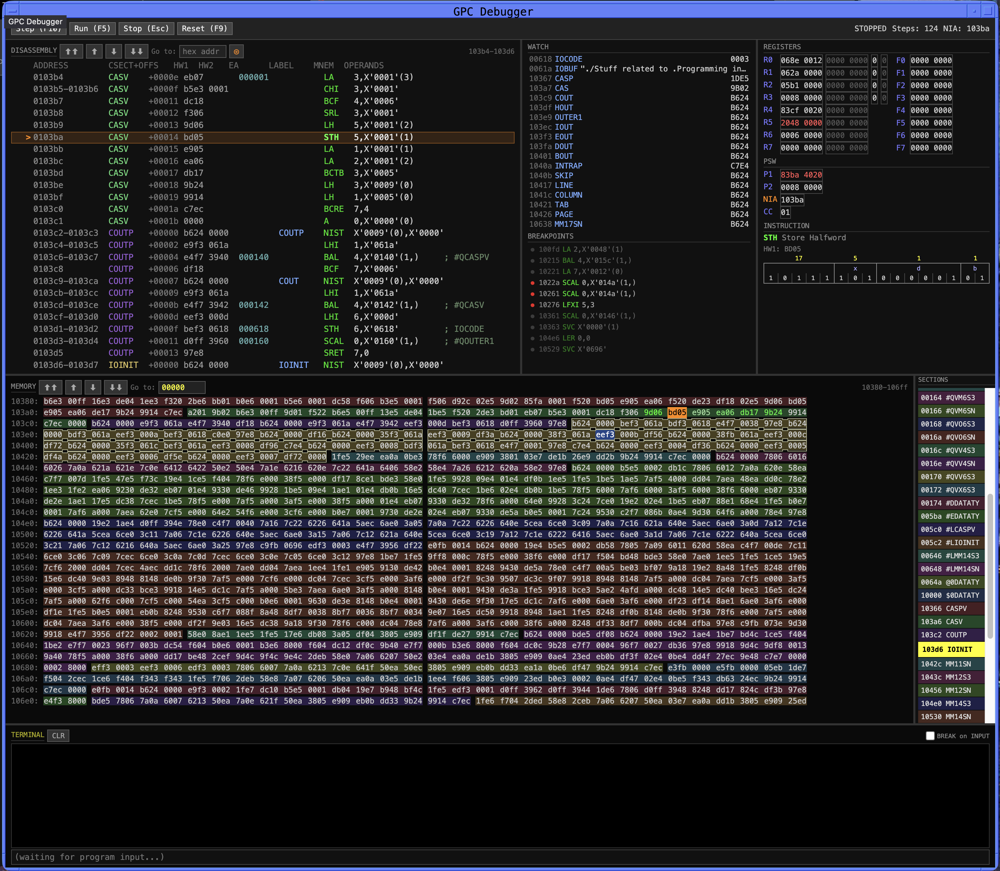

nsts-sim-gpc - Space Shuttle AP-101 Simulator
---------------------------------------------

This repository implements an instruction level simulator for the
IBM 4Pi AP-101 computer, specifically the B & S models used as the
Space Shuttle Flight Computers.

A single `gpc` command provides several entry points: a batch mode
that executes the provided code and emits a trace, a terminal-based
interactive debugger, an Electron GUI debugger, and a static
disassembler/dumper. All four read the same `.fcm` ('flight computer
memory') files.

While this tree includes a simple assembler and (very) simple linker,
the [nsts-sdl-dps](https://github.com/ColanderCombo/nsts-sdl-dps) repository provides wrappers to create a AP-101 toolchain
and a cmake based build system that is the preferred way to use the gpc-sim.

[nsts-sdl-dps](https://github.com/ColanderCombo/nsts-sdl-dps)  provides:
    - gpc wrappers
    - asm101s, A macro assembler from the virtualagc project
    - lnk101s, a relocating linker
    - halsc - wrappers around the HAL/S-FC compiler, which generates AP-101
      object modules.

The simulator loads and runs '.fcm' ('flight computer memory') files, which are
simply an absolute image of the AP-101's memory, starting at 0x00000 and extending
up to the 1MB limit.  lnk101s produces these files, and will also output a .sym.json
file containing symbols and optionally used by the debugger.

Setup
-----

The simulator is a nodejs/electron app, and requires at least node and npm be installed before use. Then SETUP.sh can be used to run all the necessary package installation and
build steps:

```
cd nsts-sim-gpc
./SETUP.sh
```

This installs electron and all the other required npm packages, so it might take a while.

If you use the simulator via the sdl build system, it will take care of all of this for you.

Prebuilt Package
----------------
If you find it inconvenient to work from the source tree, you can get a prebuilt linux AppImage or macOS bundle from the releases page:

https://github.com/ColanderCombo/nsts-sim-gpc/releases/tag/latest

These packages bundle the node and electron runtimes and should make things easier if you run into library or path problems.

Usage
-----

`GPC.sh` is a thin wrapper that builds the bundles if needed and then
dispatches to one of the `gpc` subcommands.  All subcommands take an
`.fcm` file as input.

```
Usage: gpc [options] [command]

AP-101 GPC Simulator

Commands:
  run [options] <fcm-file>        Run an AP-101 program in batch mode
  debug|dbg [options] <fcm-file>  Interactive AP-101 debugger
  gui [options] [fcm-file]        Electron GUI debugger
  dump [options] <fcm-file>       FCM dump report — symbol table and disassembly
  disasm [options] <fcm-file>     Disassemble an FCM memory image
```

  ## GPC.sh run \<fcm\>
```
Usage: gpc run [options] <fcm-file>

Run an AP-101 program in batch mode

Arguments:
  fcm-file                        FCM memory image to load

Options:
  --start <addr>                  start address in hex
  --symbols <file>                load symbol table JSON from linker
  --ebcdic                        use EBCDIC encoding for character I/O
  --trap-svc-error                intercept HAL/S SEND ERROR SVCs (default)
  --no-trap-svc-error             pass SEND ERROR SVCs to SVC handler
  --halucp-format-num-blanks <n>  blanks between WRITE output fields (default: 5)
  --line-width <n>                WRITE line width for wrap (default: 132)
  --infileN <file>                read input for channel N (0..7)
  --outfileN <file>               write output for channel N (0..7)
  --max-steps <n>                 max instructions to execute (default: 100000)
  --break <addr>                  stop at halfword address (hex)
  --watch <spec>                  memory watchpoint: addr[:count] in hex
  --watch-log                     log every watchpoint change instead of breaking
  --output <file>                 write trace/verbose output to file instead of stdout
  --dump-interval <n>             register dump every N steps (default: 100)
  --trace / --no-trace            enable/disable instruction trace (default off)
  --verbose / --no-verbose        print informational messages (default off)
  --interactive                   interactive terminal I/O
  -h, --help                      display help for command
```

  ## GPC.sh debug \<fcm\>

A readline-based REPL debugger that runs in the terminal.  Supports
single-stepping, instruction and memory breakpoints, watchpoints,
watch expressions, and disassembly.

```
Usage: gpc debug [options] <fcm-file>

Interactive AP-101 debugger

Options:
  --start <addr>                  start address in hex
  --symbols <file>                load symbol table JSON from linker
  --ebcdic                        use EBCDIC encoding for character I/O
  --trap-svc-error / --no-trap-svc-error
                                  intercept HAL/S SEND ERROR SVCs (default on)
  --halucp-format-num-blanks <n>  blanks between WRITE output fields (default: 5)
  --line-width <n>                WRITE line width for wrap (default: 132)
  --infileN / --outfileN <file>   I/O channels (0..3)
  --max-steps <n>                 max instructions before auto-stop (default: 10000000)
  --trace                         enable instruction trace at startup
```

  ## GPC.sh gui \[fcm\]

Launches the Electron-based debugger.  The fcm argument is optional;
the GUI can also load a file from the File menu.

```
Usage: gpc gui [options] [fcm-file]

Options:
  --start <addr>                  start address in hex
  --symbols <file>                load symbol table JSON from linker
  --ebcdic                        use EBCDIC encoding for character I/O
  --no-sandbox                    pass --no-sandbox to Electron (required on
                                  some Linux systems)
```



  ## GPC.sh dump \<fcm\>
```
Usage: gpc dump [options] <fcm-file>

FCM dump report — symbol table and disassembly

Options:
  --symbols <file>  symbol JSON file (default: <fcm>.sym.json)
  --no-symbols      allow running without symbol file
  --output <file>   write output to file instead of stdout
  --columns <n>     columns in symbol table grid (default: 7)
```

  ## GPC.sh disasm \<fcm\>
```
Usage: gpc disasm [options] <fcm-file>

Disassemble an FCM memory image

Options:
  --start <addr>    start address in hex
  --end <addr>      end address in hex
  --symbols <file>  load symbol table JSON from linker
```

Repository Contents
-------------------

The gpc simulator was originally part of a larger system that also simulates other avionics.  The gpc has been extracted, but things are a bit more complicated than they should be;

  - `simRunner/` contains the Electron main & renderer process implementation (now in [civet](https://civet.dev/), a TypeScript dialect).  `gpc gui` serializes its parsed CLI options to a base64 blob passed via `--cli-opts=…` to Electron, which `simRunner/main/main.civet` decodes on startup.  We use Electron only for the GUI debugger; the batch, REPL, dump, and disasm subcommands run as a plain node bundle (`dist/gpc.js`).

  - `com/` contains common utilities, including a simple 'Bus' that lets LRUs communicate via multicast UDP packets.  In the gpc it's used to emulate the physical Shuttle busses connected to the IOP.

  - `cde/` contains definitions of [Lit gui elements](https://lit.dev/), including the toplevel `<cde-window>` that styles the window to the CDE look and feel.  There's no
  compelling reason to have this, other than CDE shows up quite a bit in Shuttle documentation from the 1990's and 2000's--and I think it looks neat.

  - `esbuild/` contains build system files.  The CLI bundle is produced by `esbuild/esbuild.gpc.config.js` (= `npm run gpc:build`); the Electron main+renderer bundles by `electron-esbuild build` (= `npm run gui:build`).  Note that `gui:build` clears `dist/`, so a `gpc:build` is needed afterwards to restore the CLI bundle — `GPC.sh` handles this for you.

  - `gpc/` contains the simulated AP-101 definition
    - `gpc/data` contains some simple input to the simulator tools.  These are old.  Prefer files in the `sdl` repository
    - `gpc/dev` contains scratch and files not currently used.
    - `gpc/gen` contains a couple of `.fcm` files usable for testing.  Again, prefer files from `sdl`
    - `gpc/gui` contains the Lit-based gui elements used to build the Electron debugger.
    - `gpc/lnkasm` contains a small in-tree assembler and linker (BAL grammar in `bal.pegjs`).  This is the "simple assembler / (very) simple linker" mentioned above; for real builds use the asm101s + lnk101s toolchain in `sdl`.
    - `cli.coffee` is the unified entry point, dispatching to one of the `cmd_*.coffee` files.
    - `ap101.coffee` is the definition of the GPC LRU.
    - `cpu.coffee` / `cpu_instr.coffee` implement the CPU half of the AP-101.  Instruction definitions live in `cpu_instr.coffee`.
    - `iop.coffee` and `iop_*.coffee` implement the IOP half of the AP-101
      - `iop_msc_*.coffee` is for the IOP Master Sequence Controller (MSC)
      - `iop_bce_*.coffee` is for the many IOP Bus Control Elements (BCE)
    - `mcm.coffee` implements the Modular Core Memory (a.k.a. the RAM)
    - `membus.coffee` routes memory accesses to either the CPU or IOP package depending on address (matching AP-101B behavior).
    - `regmem.coffee` implements the registers and PSW.
    - `q31.coffee` implements Q31 / Q15 fractional fixed-point arithmetic, used by the fractional multiply/divide instructions.
    - `floatIBM.coffee` implements IBM hexadecimal floating point (with `long.js` for 56-bit mantissa precision in the double-precision paths).
    - `halUCP.coffee` implements basic (IBM style) file I/O expected by the HAL/S runtime when running in the mainframe-based SDL environment.  Useful for testing, not available in the flight configuration.  (Named after the S/360 'HAL/S User Control Program' simulator.)
    - `iohost.coffee` provides the host-side glue for `halUCP` channels (file/stdin/stdout/interactive).
    - `trace.coffee` formats per-instruction trace output.
    - `ebcdic.coffee`, `symbolTable.coffee` and `util.coffee` are utilities used by other parts of the simulator.

Development Notes
-----------------

  - The GPC simulator (and larger sim environment it's pulled from) was written over a long period of time and exhibits some strange patterns because of it.  The nodejs/electron/coffee setup allowed very fast iteration.  Today, starting from scratch, I would not choose the same environment.

  - electron was a very fast way to iterate on graphical tools for debugging (and WebGL based displays for e.g., MEDS). While it's still pretty good for that, changes in how it handles the separation between the main and rendering process have made it much less convenient to work with.

  - coffeescript is a terse, easy to read alternative to base javascript.  Unfortunately, it's been largely abandoned for years.  I've had to convert some files to typescript and even tried civet--a coffeescript-like dialect for typescript--for the Electron host.  Future work will likely be in typescript.

  - A rewrite of the AP-101 simulator in C using the SIMH framework is in progress.

AP-101 Implementation Notes
---------------------------

  - This implementation is at an *instruction* level and makes no attempt to simulate timing, microcode, or internal state.

  - The implementation is very verbose.  I've copied blocks of the POO directly into the comments and used it to guide the implementation.  Instruction opcode patterns and decoding is defined using bit strings (like '00011xxx11100yyy'), and additional format information is attached to make disassembly easier.  The intent is to make it as simple as we can to understand what the processor is doing and locate any errors in our logic.  Once verified, converting this to a much terser decoding process would make sense.

  - Implementation initially targeted the AP-101/B model originally installed in the Shuttle.  The current version includes instructions and some features from the AP-101/S upgrade.  I have not made a complete pass through the POO and implementation to verify these changes.

  - The simulator includes an implementation of the IOP coprocessor used to interface to the 24 serial shuttle busses. This implementation has only had *very* basic testing and almost certainly will not work with real MSC/BCE programs.  This is future work.

References
----------
IBM-74-A97-001 1975-03-31
Space Shuttle Advanced System/4 Pi |
Model AP-101 Central Processor Unit | Technical Description

IBM-74-A31-016 1974-10-25
Space Shuttle Advanced System/4 Pi |
Prototype Input/Output Processor (IOP) | Functional Description

IBM-85-C67-001 Rev.F 1994-07-12
Space Shuttle Model AP-101S
Principles of Operation with Shuttle Instruction Set

IBM-6246156B 1974-12-15
Space Shuttle Model AP-101 C/M Principles of Operation

IBM-6246556A 1976-04-26
Space Shuttle Advanced System/4 Pi Input/Output Processor (IOP) |
    Principles of  Operation for PCI/PCO, MSC and BCE
