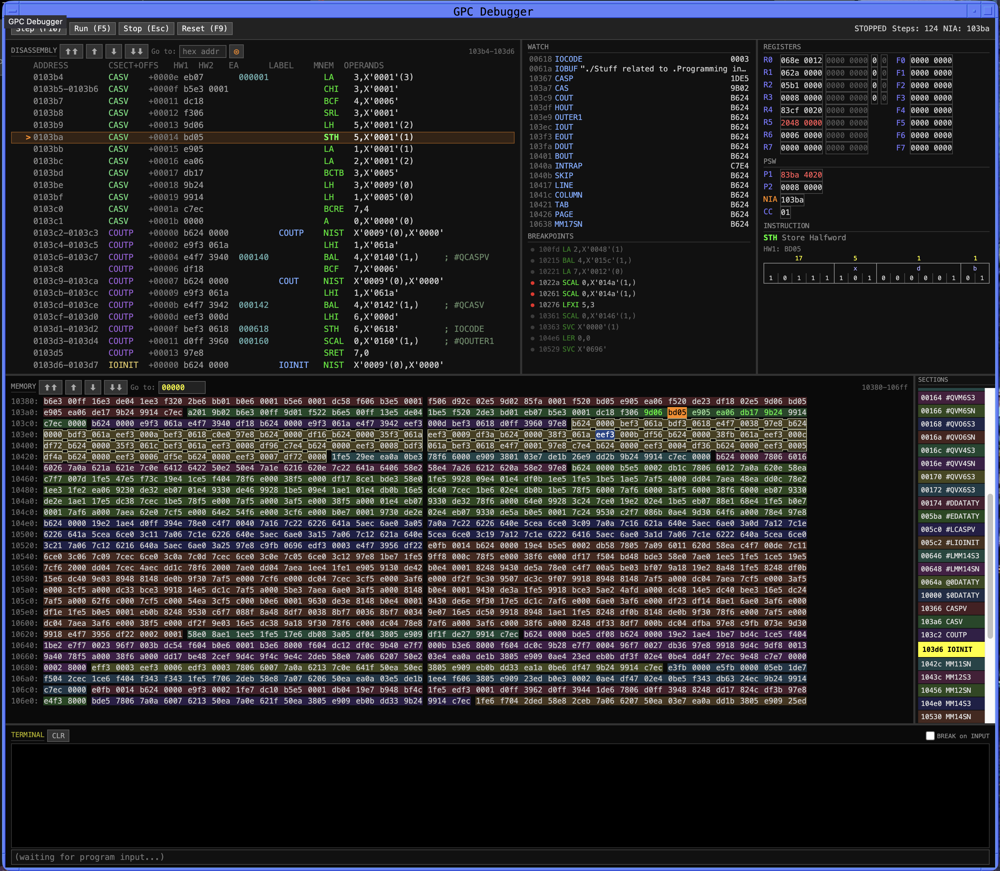

nsts-sim-gpc - Space Shuttle AP-101 Simulator
---------------------------------------------

This repository implements an instruction level simulator for the
IBM 4Pi AP-101 computer, specifically the B & S models used as the
Space Shuttle Flight Computers.

A single `gpc` command provides several entry points: a batch mode
that executes the provided code and emits a trace, a terminal-based
interactive debugger, the same debugger headless on a socket, an
Electron GUI debugger, and a static disassembler/dumper. All of them
read the same `.fcm` ('flight computer memory') files.

The repository also contains a simulator for MEDS, the Multifunction
Electronic Display System ("glass cockpit") that replaced the original
CRT/DEU displays.  A `meds` command launches MDU display units and
IDPs (Interface/Display Processors) in their own windows; they talk to
each other — and to running GPCs — over the same simulated UDP-multicast
flight-critical busses.  See the MEDS section below.

While this tree includes a simple assembler and (very) simple linker,
the [nsts-sdl-dps](https://github.com/ColanderCombo/nsts-sdl-dps) repository provides wrappers to create a AP-101 toolchain
and a cmake based build system that is the preferred way to use the gpc-sim.

[nsts-sdl-dps](https://github.com/ColanderCombo/nsts-sdl-dps)  provides:
    - gpc wrappers
    - asm101s, A macro assembler from the virtualagc project
    - lnk101s, a relocating linker
    - halsc - wrappers around the HAL/S-FC compiler, which generates AP-101
      object modules.

The simulator loads and runs '.fcm' ('flight computer memory') files, which are
simply an absolute image of the AP-101's memory, starting at 0x00000 and extending
up to the 1MB limit.  lnk101s produces these files, and will also output a .sym.json
file containing symbols and optionally used by the debugger.

Setup
-----

The simulator is a nodejs/electron app, and requires at least node and npm be installed before use. Then SETUP.sh can be used to run all the necessary package installation and
build steps:

```
cd nsts-sim-gpc
./SETUP.sh
```

This installs electron and all the other required npm packages, so it might take a while.

If you use the simulator via the sdl build system, it will take care of all of this for you.

Prebuilt Package
----------------
If you find it inconvenient to work from the source tree, you can get a prebuilt linux AppImage or macOS bundle from the releases page:

https://github.com/ColanderCombo/nsts-sim-gpc/releases/tag/latest

These packages bundle the node and electron runtimes and should make things easier if you run into library or path problems.

Usage
-----

`GPC.sh` is a thin wrapper that builds the bundles if needed and then
dispatches to one of the `gpc` subcommands.  All subcommands take an
`.fcm` file as input.

```
Usage: gpc [options] [command]

AP-101 GPC Simulator

Commands:
  run [options] <fcm-file>        Run an AP-101 program in batch mode
  debug|dbg [options] <fcm-file>  Interactive AP-101 debugger
  dbg-serve [options] [fcm-file]  Headless debugger on a socket
  dbg-client [options] [cmd...]   Send a command to a dbg-serve session
  gui [options] [fcm-file]        Electron GUI debugger
  dump [options] <fcm-file>       FCM dump report — symbol table and disassembly
  disasm [options] <fcm-file>     Disassemble an FCM memory image
```

  ## GPC.sh run \<fcm\>
```
Usage: gpc run [options] <fcm-file>

Run an AP-101 program in batch mode

Arguments:
  fcm-file                        FCM memory image to load

Options:
  --start <addr>                  start address in hex
  --power-on                      enter from the power-on PSW in the PSA
  --sys-reset                     enter through the system reset PSW in the PSA
  --ipl                           run hardware IPL on startup, as though the IPL
                                  discrete was asserted.
  --symbols <file>                load symbol table JSON from linker
  --ebcdic                        use EBCDIC encoding for character I/O
  --trap-svc-error                intercept HAL/S SEND ERROR SVCs (default)
  --no-trap-svc-error             pass SEND ERROR SVCs to SVC handler
  --halucp-format-num-blanks <n>  blanks between WRITE output fields (default: 5)
  --line-width <n>                WRITE line width for wrap (default: 132)
  --infileN <file>                read input for channel N (0..7)
  --outfileN <file>               write output for channel N (0..7)
  --max-steps <n>                 max instructions to execute (default: 100000)
  --real-time                     pace execution at AP-101 speed
  --rt-factor <x>                 real-time speed multiplier (2 = 2x real speed)
  --rt-idle-timeout <s>           stop after this long in the wait state with no wakeup
  --break <addr>                  stop at halfword address (hex)
  --break-on-interrupt            stop when an interrupt is accepted
  --hold-interrupt                stop just before an interrupt swaps PSWs
  --watch <spec>                  memory watchpoint: addr[:count] in hex
  --watch-log                     log every watchpoint change instead of breaking
  --output <file>                 write trace/verbose output to file instead of stdout
  --dump-interval <n>             register dump every N steps (default: 100)
  --trace / --no-trace            enable/disable instruction trace (default off)
  --verbose / --no-verbose        print informational messages (default off)
  --interactive                   interactive terminal I/O
  -h, --help                      display help for command
```

### IPL

`--ipl` implements the hardware Initial Program Load as described in 
IBM-74-A31-016/p.68 sect.2.7.  In response to the IPL discrete being
asserted while the CPU is in the `HALT` state, IOP microcode sequences
clearing memory and loading an initial bootloader `FCMBOOT` from a
fixed location on the MMU.  `FCMBOOT` then manages reading the complete
`GPCIPL` system loader from MMU.

```
node dist/mmu.js run --unit 1 --volume /path/to/mmu.mmv &
node dist/gpcmd.js unit --idp 1 --ipl-request &
GPC.sh run --ipl --real-time --max-steps 0 --gpc 4
# once the menu is up on DK1:
node dist/gpcmd.js key --idp 1 ITEM 1 EXEC
node dist/gpc.js discretes mode run --gpc 4
```

`--ipl` stands in for the panel, which can drive the same thing from
outside: the mode toggle to HALT holds the CPU in system reset and halts
every IOP processor, a press of the IPL button then loads, and moving the
toggle off HALT starts the machine from the system reset PSW.

```
node dist/gpc.js discretes mode halt --gpc 4   # or `panel`, then `halt`
node dist/gpc.js discretes ipl --gpc 4         # the pushbutton
node dist/gpc.js discretes mode run --gpc 4
```

Each line runs to one computer, on port 6980 + GPC ID, and every
`discretes` subcommand takes `--gpc <n>` to say which.  `set`, `mode`,
`ipl` and `watch` also take a comma list or `all`.  GPC 0, the default,
is a standalone computer.

On real hardware the IPL is implemented in microcode, but since we don't
currently implement microcode we have a stand-in assembly program at
`gpc/asm/fakeipl.asm` (pre-generated object code at 
`gpc/gen/fakeipl.json`).  This program is placed at 0x3FF80.  This is
a deviation from real hardware, but the idea is to do something *close*
to what the hardware actually does, which includes running MSC/BCE programs
to read from MMU. 

  ## GPC.sh debug \<fcm\>

A readline-based REPL debugger that runs in the terminal.  Supports
single-stepping, instruction and memory breakpoints, watchpoints,
watch expressions, and disassembly.

```
Usage: gpc debug [options] <fcm-file>

Interactive AP-101 debugger

Options:
  --start <addr>                  start address in hex
  --symbols <file>                load symbol table JSON from linker
  --ebcdic                        use EBCDIC encoding for character I/O
  --trap-svc-error / --no-trap-svc-error
                                  intercept HAL/S SEND ERROR SVCs (default on)
  --halucp-format-num-blanks <n>  blanks between WRITE output fields (default: 5)
  --line-width <n>                WRITE line width for wrap (default: 132)
  --infileN / --outfileN <file>   I/O channels (0..3)
  --max-steps <n>                 max instructions before auto-stop (default: 10000000)
  --trace                         enable instruction trace at startup
  --break-on-interrupt            stop when an interrupt is accepted
  --hold-interrupt                stop just before an interrupt swaps PSWs
```

Interrupt and interval-timer commands:

```
  int                     interval timers, the interrupt repertoire, and what is
                          pending, masked or blocked
  int raise <key> [code]  force an interrupt (clk1 clk2 ext0..ext4 svc
                          machineCheck programCheck instrMonitor)
  int clear <key>         clear a pending latch
  int mask <bit> [on|off] change a PSW mask bit (32-39 system, 45 machine check)
  int log [count]         interrupts accepted, with simulated time and NIA
  int break [on|off]      break when an interrupt is accepted
  int hold [on|off]       stop in front of the PSW swap, not after it
  timer [n] [value]       show or load an interval timer (as the ICR would)
```

`int break` stops at the first instruction of the handler; `int hold`
stops one step earlier, at the instant the interrupt is accepted and
before the PSW swap, so the registers, the PSW and the NIA are still the
interrupted program's and the old-PSW slot still holds what was there
before.  The next `step` performs the swap alone, landing on the
handler's first instruction without executing it; `run` performs it and
carries on. 

  ## GPC.sh dbg-serve \<fcm\> / GPC.sh dbg-client \<command\>

The same debugger with a socket in place of the terminal.  `dbg-serve` holds
the machine in a process that outlives any one command; `dbg-client` sends it
one command and prints the answer.  A debugging session is then a sequence of
separate shell commands against a machine that keeps its place between them,
which is what makes it drivable from a script, a Makefile, or an agent.

```
GPC.sh dbg-serve prog.fcm &              # hold a session, port 4444
GPC.sh dbg-client break MYPROC           # ... set a breakpoint by symbol
GPC.sh dbg-client continue               # ... run until it hits
GPC.sh dbg-client regs                   # ... look around
GPC.sh dbg-client mem MYVAR 8
GPC.sh dbg-client --json regs R6         # ... structured, for a program
GPC.sh dbg-client shutdown
```

With no command arguments the client reads one command per line from stdin,
so a whole session is one invocation:

```
printf 'break MYPROC\ncontinue\nregs\ntracelog 20\n' | GPC.sh dbg-client
```

`help` lists the commands and `help <command>` describes one.  The vocabulary
follows the REPL debugger's: `step`, `next`, `continue`, `until`, `pause`,
`break`/`bclear`/`breakpoints`, `watchmem` (data breakpoints, on change or on
any write), `watch`, `mem`/`writemem`, `regs`/`setreg`, `disasm`, `sym`,
`sections`, `resolve`, `ints` and the `int*` controls, `timers`, `iop`,
`iopdisasm`, `realtime`, `output` and `input`.  Addresses are hex, a symbol,
or either with a `+`/`-` offset (`IOINIT+0x10`).

Beyond it: `trace`/`tracelog`, `busmon`/`buslog`/`bus`,
`discretes`/`discmon`/`disclog`/`discset`, `log`/`logstop`,
`logpoint`/`logpoints`, `find`, and the symbol layers
`symload`/`symswitch`/`symlayers`.

### Watching the machine

`trace on` records the instructions that execute into a ring, and `tracelog`
prints it back disassembled — the last N instructions before a stop, without
the cost of streaming every one of them.

`busmon on` taps every word crossing every BCE's bus, `buslog` prints it back
grouped into transactions, and `bus` lists what this GPC is attached to with
its transmit/receive enables and counts.  The tap sees more than the MIA's own
64-word ring keeps, and `--bus DK1,MM1` narrows it.

```
GPC.sh dbg-client busmon on --limit 4000
GPC.sh dbg-client buslog 20              # ... as transactions
GPC.sh dbg-client buslog 40 --words      # ... word by word
```

`discretes` shows the discrete input and output registers decoded to named
lines (`halt`, `standby`, `run`, `ipl`, `mm1ready`, `gpcid0`…), `discmon on`
records every change to them, and `disclog` prints those back.  Discrete
inputs arrive from other processes at any time, so the monitor hooks the
receive path and sees them whether or not the machine is running; the outputs
are written by a PCO and are sampled once per instruction.  `discset run`
drives a line directly, standing in for the box that owns it.

Traffic is dense, so a monitor fills its ring and any open log but does not
push events at connected clients unless asked: add `--events` to have it
broadcast as well.

### Recording to a file

`log <file>` records what the session publishes, one line per record, stamped
with **both clocks** — the host's wall clock, for lining a run up against
anything outside this process, and the machine's simulated time, which is the
only one that means anything between two events inside it.

```
GPC.sh dbg-client log run.ndjson --kinds bus,discrete,stopped
GPC.sh dbg-client log run.txt --format text     # a padded line per record
GPC.sh dbg-client log                           # what is being recorded
GPC.sh dbg-client logstop
```

`--kinds` selects what is recorded; with none, everything the session
publishes. `ndjson` gives `{kind, stamp, body}` per line; `text` gives a
column-aligned line for reading.

### Breakpoints that do not stop

`logpoint <addr> [message]` records an arrival — location, hit count, the
general registers — and lets the run carry on.  It is the way to see a path
taken thousands of times without stopping at any of it.

`break` takes `--ignore N` to pass the first N arrivals (the hit count still
counts them) and `--once` to remove itself after firing.  `breakpoints` lists
hit counts.

### Symbols for an overlay

A load or an overlay puts different code at addresses another load already
named, so one symbol table per image does not describe the machine.  Symbol
tables are layered over the image's own, each optionally scoped to an address
range, and a lookup takes the topmost enabled layer covering the address.

```
GPC.sh dbg-client symload OVL_A.sym.json --name A --lo 10000 --hi 1ffff
GPC.sh dbg-client symload OVL_B.sym.json --name B --lo 10000 --hi 1ffff
GPC.sh dbg-client symswitch A      # A is in force; B stands down
GPC.sh dbg-client symlayers        # what is loaded and which are in force
GPC.sh dbg-client symunload B
```

`symswitch` enables one layer and disables every other layer whose range
overlaps it, which is the state after a load: the addresses belong to what was
loaded last, and the layers describing what used to be there stay on the stack
to switch back to.  `sym` and `sections` report which layer a name came from,
and `resolve` names it for one address.

### Searching memory

```
GPC.sh dbg-client find 4142 4344                    # a run of halfwords
GPC.sh dbg-client find --text ERROR --encoding ebcdic
GPC.sh dbg-client find --text ABC --start 10000 --end 1ffff
```

### Server options

```
  --port <n>              TCP port to listen on (default: 4444)
  --host <addr>           address to bind (default: 127.0.0.1)
  --no-tcp                do not listen on TCP; requires --socket
  --socket <path>         also listen on a unix socket
  --name <name>           session name, for the session file
  --session-file <path>   where to record the endpoint
  --break <addr>          set a breakpoint before starting (repeatable)
  --trace                 start with the instruction trace ring on
  --max-steps <n>         step budget for one continue
```

The server records its endpoint in `<tmpdir>/gpc-dbg/<name>.json`, and a
client given no `--port`/`--socket` connects to whichever session started
last.  `--name` picks among several.

### The protocol

One JSON object per line, both ways.  A request:

```json
{"id": 1, "cmd": "step", "args": {"count": 10}, "text": true}
```

and its reply, `text` carrying the rendered form when the request asked for
it:

```json
{"id": 1, "ok": true, "result": {"reason": "step", "steps": 10, ...}}
{"id": 1, "ok": false, "error": {"code": "badArgs", "message": "..."}}
```

Execution commands reply when the machine stops, so replies can arrive out of
order; each carries the id of its request.  Queries are answered while a run
is in progress, and `pause` stops one.

Events are pushed to every connection, unsolicited:

```json
{"event": "stopped", "seq": 12, "body": {"reason": "breakpoint", ...}}
```

`stopped`, `continued`, `running` (progress at each refresh interval),
`output` (program output as it is written), and `input` (the program is
waiting for a read).  Stop reasons are DAP's vocabulary where one applies —
`entry`, `step`, `breakpoint`, `data breakpoint`, `pause`, `exception` — with
`halt`, `interrupt`, `interrupt held`, `input` and `step budget` added for the
states an AP-101 has and a hosted process does not.

A line that is not JSON is taken as a command line — `step 10` — and answered
with `text` filled in.  It carries no id, so its reply has `id: null`; a
client issuing more than one command at a time sends JSON.  `mode text`
switches a connection to plain-text replies, each closed by a blank line,
which is what makes the server usable from `nc`:

```
$ nc 127.0.0.1 4444
mode text
break MYPROC
continue
```

The GUI is another client of this protocol: every pane it draws is filled
from one of these commands.  See **GPC.sh gui** below.

  ## GPC.sh gui \[fcm\]

Launches the Electron-based debugger.  The fcm argument is optional;
the GUI can also load a file from the File menu.

```
Usage: gpc gui [options] [fcm-file]

Options:
  --start <addr>                  start address in hex
  --symbols <file>                load symbol table JSON from linker
  --ebcdic                        use EBCDIC encoding for character I/O
  --real-time                     start with real-time pacing on
  --rt-factor <x>                 real-time speed multiplier (2 = 2x real speed)
  --rt-idle-timeout <s>           stop after this many wall seconds in wait
                                  state with no wakeup
  --max-steps <n>                 step budget for one Run (default: 10000000)
  --attach                        do not start a session; join one already
                                  running
  --port <n>                      TCP port: of the session to attach to, or to
                                  listen on (default: an ephemeral one)
  --name <name>                   session name, used for the session file
  --no-session-file               do not record the endpoint anywhere
  --no-sandbox                    pass --no-sandbox to Electron (required on
                                  some Linux systems)
```

The window drives a debug session, so `gpc dbg-client` can work on the same
machine from a terminal — breakpoints, memory, bus and discrete monitoring —
while the panes watch.  `--attach` joins a `dbg-serve` already running instead
of starting a session, and the session outlives the window.

Simulated CPU time is tracked per instruction so a debugging session sees 
the same interrupt sequence a straight run does.  The toolbar's **Real-time** 
checkbox additionally ties that simulated time to the wall clock: execution 
is paced to AP-101 speed (times the factor beside it). In real-time mode,
entering the wait state advances simulated time until an interval timer 
or other interrupt wakes the CPU (The IOP will continue to run).
`Step` in the wait state does the same in one jump, landing on the next
interrupt.  The toolbar shows simulated time since power-on and how fast 
it is running against the wall clock.

Execution runs in 200 ms slices of wall time between display refreshes,
so the panes update at a steady rate whatever speed the host manages.

Interrupts
==========

The **Interrupts** pane collects interrupt history and controls, presenting
the pending latch, the PSW mask bit, and the PSA vector. It shows both 
interval timers (editable), every interrupt its class, mask bit and new-PSW 
address, and a log of what has been accepted and where it went.  Buttons raise
or clear a pending latch the way the AGE could, a click on the mask cell
flips that bit in the PSW, `break` stops the run at the first instruction
of any handler, `hold` stops it one step earlier — in front of the PSW
swap, with the interrupted program still in the registers and the NIA,
which Step or Run then completes — and `system reset` performs the POO
2.5.3.2 reset.  What is being held is spelled out under the interrupt
list and on the toolbar (`INT HELD`).

IOP
===

The **IOP** pane presents the current state of the Input/Output Processor.
The IOP is a timesliced parallel processor.  One ALU and datapath is shared
by one "Master Sequence Controller" (MSC) and 24 "Bus Control Elements" (BCEs).
Each tick the IOP executes instructions for one processor, stepping through
the MSC and BCEs in order (each BCE get's one slot/round, the MSC gets several)

In the panel, a foldable **REGISTERS** section lists every register that
belongs to the IOP rather than to one processor, raw: the four
per-processor status words (STAT1/STAT4/STAT5 and the indicator bits),
the MIA enables, the RM status word the CPU reads and the latch word
behind it, all five interrupt registers, the discretes, the data word the
last PCI/PCO left, the GO/NO-GO count and the MSC's own two.

Below that each processor is one line — its STAT5/STAT4/STAT1, its MIA 
transmitter and receiver enables, and its local store registers
(PC, the fetched instruction, and then X/ACC/ECR/status for the MSC or
D/ID/MTO/BASE/IUAR/status for a BCE).  

Clicking a processor unfolds three more lines: a short disassembly at its
PC (with the PC's own instruction highlighted, in the MSC or BCE
instruction set as appropriate), then a ring of the words its MIA has put
on its bus and a ring of the words that have come back — command words
starred, each with the simulated time it crossed.  

`active only` hides the processors that are halted, idle and silent.

An existing saved layout won't have the newer panes: right-click a pane
and pick **Add editor → Interrupts** or **→ IOP** (the default layout
carries both as tabs beside Watch and Breakpoints).



  ## GPC.sh dump \<fcm\>
```
Usage: gpc dump [options] <fcm-file>

FCM dump report — symbol table and disassembly

Options:
  --symbols <file>  symbol JSON file (default: <fcm>.sym.json)
  --no-symbols      allow running without symbol file
  --output <file>   write output to file instead of stdout
  --columns <n>     columns in symbol table grid (default: 7)
```

  ## GPC.sh disasm \<fcm\>
```
Usage: gpc disasm [options] <fcm-file>

Disassemble an FCM memory image

Options:
  --start <addr>    start address in hex
  --end <addr>      end address in hex
  --symbols <file>  load symbol table JSON from linker
```

MEDS — Glass Cockpit Displays
-----------------------------

`MEDS.sh` builds the bundles if needed and launches MEDS LRUs by name.
LRU definitions (which MDU position, which IDP, window geometry, initial
display) live in `config/meds.json`.

```
MEDS.sh --list                 # list available LRU names
MEDS.sh crt1 idp1              # a center CRT MDU fed by IDP1
MEDS.sh cdr1 plt1 idp1 idp2    # commander + pilot MDUs
MEDS.sh --display AE_PFD crt2  # override the initial display
MEDS.sh --dev crt1             # developer mode (standalone MDU)
```


MDU positions match the orbiter cockpit: `crt1`–`crt4` (center),
`cdr1`/`cdr2` (commander), `plt1`/`plt2` (pilot), `mfd1`/`mfd2`,
and `afd1` (aft flight deck).  IDPs (`idp1`–`idp4`) are headless — they
join the bus mesh from a host window's renderer process.

Each MDU is a 720x720 vector display rendered with Three.js: the
edgekey menu system, the AE PFD with its 3D ADI ball and scrolling 
AMI/AVVI tapes, and various subsystem status displays (HYD/APU, 
OMS/MPS, SPI, ...).  The DPS display implements the original DEU 
FCW protocol generated by shuttle software.

*** Keybindings

The MDU edgekeys sit along the bottom of the screen, and `F1`-`F6` press
them:

<table style="width:50%;table-layout:fixed;border-collapse:collapse;text-align:center;">
<colgroup><col style="width:7.143%"><col style="width:7.143%"><col style="width:7.143%"><col style="width:7.143%"><col style="width:7.143%"><col style="width:7.143%"><col style="width:7.143%"><col style="width:7.143%"><col style="width:7.143%"><col style="width:7.143%"><col style="width:7.143%"><col style="width:7.143%"><col style="width:7.143%"><col style="width:7.143%"></colgroup>
<tr>
  <td colspan="14" style="height:7em;border:1px solid #888;"></td>
</tr>
<tr>
  <td colspan="1"></td>
  <td colspan="2" style="border-left:2px solid #2a6fdb;border-right:2px solid #2a6fdb;border-top:2px solid #2a6fdb;border-bottom:none;padding:0.4em 0;">(F1)</td>
  <td colspan="2" style="border-left:2px solid #2a6fdb;border-right:2px solid #2a6fdb;border-top:2px solid #2a6fdb;border-bottom:none;padding:0.4em 0;">(F2)</td>
  <td colspan="2" style="border-left:2px solid #2a6fdb;border-right:2px solid #2a6fdb;border-top:2px solid #2a6fdb;border-bottom:none;padding:0.4em 0;">(F3)</td>
  <td colspan="2" style="border-left:2px solid #2a6fdb;border-right:2px solid #2a6fdb;border-top:2px solid #2a6fdb;border-bottom:none;padding:0.4em 0;">(F4)</td>
  <td colspan="2" style="border-left:2px solid #2a6fdb;border-right:2px solid #2a6fdb;border-top:2px solid #2a6fdb;border-bottom:none;padding:0.4em 0;">(F5)</td>
  <td colspan="2" style="border-left:2px solid #2a6fdb;border-right:2px solid #2a6fdb;border-top:2px solid #2a6fdb;border-bottom:none;padding:0.4em 0;">(F6)</td>
  <td colspan="1"></td>
</tr>
</table>

DPS Keyboard Unit buttons are mapped to regular keyboard keys (mapped key in parenthesis):

|                              |                            |                               |                       |
| :--------------------------: | :------------------------: | :---------------------------: | :-------------------: |
| <sub>(u)</sub><br>FAULT SUMM | <sub>(y)</sub><br>SYS SUMM | <sub>(esc)</sub><br>MSG RESET | <sub>(k)</sub><br>ACK |
|  <sub>(g)</sub><br>GPC/CRT   |             A              |               B               |           C           |
| <sub>(t)</sub><br>I/O RESET  |             D              |               E               |           F           |
|    <sub>(i)</sub><br>ITEM    |             1              |               2               |           3           |
|  <sub>(enter)</sub><br>EXEC  |             4              |               5               |           6           |
|    <sub>(o)</sub><br>OPS     |             7              |               8               |           9           |
|    <sub>(s)</sub><br>SPEC    |             -              |               0               |           +           |
|   <sub>(r)</sub><br>RESUME   | <sub>(bksp)</sub><br>CLEAR |               .               | <sub>(p)</sub><br>PRO |


Debug tools: The `--dev` option enables a standalone development 
mode that enables tools for refining the drawing and display features
of the software.  In `--dev` mode defaults are set for non-DPS
displays and a double-click outside of the canvas enabled a debug 
pane that lets you manually set ADI values or enable test sweeps.  
The DPS display adds hotkeys to load local test dfbs.  `--dev` mode 
also disables the DPS poll timout; normally you'll get the big-red-X 
and a  'POLL FAIL' message on the DPS screen without a stream of polls

### gpcmd — simulated GPC command traffic

`GPCMD.sh` puts that traffic on a bus itself, standing in for a GPC:
the same commands in the same two-halfword form, with data one 
halfword at a time.

```
GPCMD.sh monitor                              # decode every bus, both ways
GPCMD.sh monitor DK1 --fcw                    # ... disassembling the formats
GPCMD.sh unit --idp 1                         # BE a display unit, headless
GPCMD.sh unit --ipl-request --fcw             # ... and ask to be loaded
GPCMD.sh fill data/TEST-9011-GPC_MEMORY.dfb   # display data fill
GPCMD.sh fill f.dfb --addr 19EE --format      # ... as a format data fill
GPCMD.sh time --interval 1                    # the MET/CRT header clock
GPCMD.sh time --met 2/03:45:00 --interval 1   # ... starting at a given MET
GPCMD.sh poll --interval 1                    # poll, and print the response
GPCMD.sh bite                                 # BITE status request
GPCMD.sh resetspl                             # clear the scratch pad line
GPCMD.sh raw 71800 0001 19EE                  # a 19-bit command + payload
GPCMD.sh watch DK1                            # decode traffic on a bus
```

A fill clears the DPS display's POLL FAIL state, and the header clock
takes over from the IDP's local one as soon as any command arrives.

`monitor` is the one to reach for first.  A raw word dump is nearly
useless on this bus -- a transaction is a command datagram followed by up
to 511 single-word datagrams, and the meaning is in the reassembly -- so
it rebuilds each transaction and prints one line per message with the
fields decoded: fill address and length, poll response header flags and
keystrokes by name, checksum verified.  `--fcw` disassembles a fill
payload as display instructions, which is how you see what a format
actually draws; `--json` writes a record per message for later analysis.

`unit` is a display unit with no window, running the SAME protocol state
machine the MEDS IDP runs (`meds/deuUnit.coffee`), with its own keyboard
on `_KYBDn` so `GPCMD.sh key` reaches it.  It is the fast way to drive
flight software and see exactly what it sent: `--ipl-request` asks the GPC
to load the unit, `--no-bite` answers with a zero BITE register (which is
what a GPC reads as no response at all), and `--dump` writes display
memory out on exit.

MMU — Mass Memory Unit
----------------------

`MMU.sh` runs a mass memory unit on its bus and answers a GPC.  

```
MMU.sh run --unit 1 --volume tape.mmv   # serve a tape on MM1 (BCE 18)
MMU.sh create tape.mmv                  # an empty volume
MMU.sh put tape.mmv 0/0/0/0 data.bin    # lay halfwords on the tape
MMU.sh get tape.mmv 4/4/3/8 --blocks 17 # read them back
MMU.sh ls tape.mmv                      # what a volume holds
MMU.sh dump tape.mmv 4/4/3/8            # hex dump one block
MMU.sh watch MM1 --decode               # decode the bus traffic
MMU.sh send MM1 588000                  # put one command on the bus
```

sim — running a configuration
-----------------------------

Running a simulation requires running and managing several processes
simultaneously.  Minimally, we need a GPC, a MEDS display and a MMU to
serve the software.  In the future, other LRUs like MDMs and other systems
will add to this.  `SIM.sh` lets us configure a simulation consisting of
multiple processes and manage their lifecycle together.

```
SIM.sh                          # the terminal interface
SIM.sh run                      # the same supervisor with no interface
SIM.sh run mmu1 gpc4            # ... only these
SIM.sh list                     # what is in this configuration
SIM.sh config                   # the configuration as sim resolved it
SIM.sh -r config/entry.yml      # manage a different configuration
```

`config/sim.yml` is the LRU catalog: what kinds there are, the command that
runs one, where its files live, and how to tell whether it is up.
`config/runConfig.yml` is the configuration being managed: which LRUs, in
what order they come up, and what each is given.  Both are commented, and
`SIM.sh config` shows them resolved.

`config/selftest.yml` is four synthetic LRUs, for exercising the supervisor
while a real session is running:

```
SIM.sh -c config/selftest.yml -r config/selftest-run.yml
```

Each LRU's output is appended to `run/logs/<lru>.log`.

Repository Contents
-------------------

The gpc simulator was originally part of a larger system that also simulates other avionics.  The gpc has been extracted, but things are a bit more complicated than they should be;

  - `simRunner/` contains the Electron main & renderer process implementation (now in [civet](https://civet.dev/), a TypeScript dialect).  `gpc gui` serializes its parsed CLI options to a base64 blob passed via `--cli-opts=…` to Electron, which `simRunner/main/main.civet` decodes on startup.  We use Electron only for the GUI debugger; the batch, REPL, dump, and disasm subcommands run as a plain node bundle (`dist/gpc.js`).

  - `com/` contains common utilities, including a simple 'Bus' that lets LRUs communicate via multicast UDP packets.  In the gpc it's used to emulate the physical Shuttle busses connected to the IOP; MEDS uses the same busses for IDP↔MDU and (eventually) GPC↔IDP traffic.

  - `mmu/` contains a simulation of the Shuttle Mass Memory Unit: 
    - `mmu.coffee`, 
    - `volume.coffee` (the tape and its file format), 
    - `mmuConf.coffee` (geometry, command and status layouts)
    - `cli.coffee` (the `MMU.sh` command). 

  - `sim/` is the supervisor behind `SIM.sh`, in Python:
    - `config.py` (the two YAML files, resolved into what is actually run),
    - `process.py` (one child: its process group, its signals, its output),
    - `health.py` (the probes that decide whether a running LRU is well),
    - `supervisor.py` (the ordered start, the restart policy, the terminate),
    - `screen.py`, `views.py` and `tui.py` (the curses interface),
    - `cli.py` (the `SIM.sh` command).
  - `config/sim.yml` and `config/runConfig.yml` are what it reads;
    `config/selftest*.yml` are synthetic LRUs for trying it.
  - `meds/` contains the MEDS simulator: 
    - `mdu.coffee` (display unit), 
    - `idp.coffee` (Interface/Display Processor), 
    - `deuProto.coffee` (the display-keyboard bus protocol), 
    - `deuFCW.coffee` (Format Control Word specification-- the DEU's drawing language),
    -  `mduScreen_*.coffee` (the individual displays), 
    -  `mduVectorDisplay.coffee` (Three.js vector renderer),
    -  `medsConf.coffee` (the orbiter's MDU/IDP/bus wiring).  
    -  `dfbDump.coffee` and `dpsDispToFcb.coffee` are node-side tools for the display-format binaries in `data/`.
    -  `fcwCal.coffee` measures the beam grid a format control word stream is written on -- the character
       and vector lattices, and which wrap the stream will fit into.  `node esbuild/esbuild.fcwcal.config.js`
       then `node dist/fcwCal.js <file.dfb>`.  Use it before changing the constants in `deuFCW`.

  - `config/meds.json` defines the launchable MEDS LRUs; `data/` holds the DEU/MEDS vector fonts and sample DFB files.

  - `cde/` contains definitions of [Lit gui elements](https://lit.dev/), including the toplevel `<cde-window>` that styles the window to the CDE look and feel.  There's no
  compelling reason to have this, other than CDE shows up quite a bit in Shuttle documentation from the 1990's and 2000's--and I think it looks neat.

  - `esbuild/` contains build system files.  The CLI bundle is produced by `esbuild/esbuild.gpc.config.js` (= `npm run gpc:build`); the Electron main+renderer bundles by `electron-esbuild build` (= `npm run gui:build`).  Note that `gui:build` clears `dist/`, so a `gpc:build` is needed afterwards to restore the CLI bundle — `GPC.sh` handles this for you.

  - `gpc/` contains the simulated AP-101 definition
    - `gpc/data` contains some simple input to the simulator tools.  These are old.  Prefer files in the `sdl` repository
    - `gpc/dev` contains scratch and files not currently used.
    - `gpc/gen` contains a couple of `.fcm` files usable for testing.  Again, prefer files from `sdl`
    - `gpc/gui` contains the Lit-based gui elements used to build the Electron debugger.
    - `gpc/lnkasm` contains a small in-tree assembler and linker (BAL grammar in `bal.pegjs`).  This is the "simple assembler / (very) simple linker" mentioned above; for real builds use the asm101s + lnk101s toolchain in `sdl`.
    - `cli.coffee` is the unified entry point, dispatching to one of the `cmd_*.coffee` files.
    - `ap101.coffee` is the definition of the GPC LRU.
    - `cpu.coffee` implements the AP-101's CPU
      -  `cpu_instr.coffee` CPU instruction definitions.
      -  `cpu_intr.coffee` CPU interrupt handling routines
    - `iop.coffee` and `iop_*.coffee` implement the IOP half of the AP-101
      - `iop_msc_*.coffee` is for the IOP Master Sequence Controller (MSC)
      - `iop_bce_*.coffee` is for the many IOP Bus Control Elements (BCE)
    - `mcm.coffee` implements the Modular Core Memory (a.k.a. the RAM)
    - `membus.coffee` routes memory accesses to either the CPU or IOP package depending on address (matching AP-101B behavior).
    - `regmem.coffee` implements the registers and PSW.
    - `q31.coffee` implements Q31 / Q15 fractional fixed-point arithmetic, used by the fractional multiply/divide instructions.
    - `floatIBM.coffee` implements IBM hexadecimal floating point (with `long.js` for 56-bit mantissa precision in the double-precision paths).
    - `halUCP.coffee` implements basic (IBM style) file I/O expected by the HAL/S runtime when running in the mainframe-based SDL environment.  Useful for testing, not available in the flight configuration.  (Named after the S/360 'HAL/S User Control Program' simulator.)
    - `iohost.coffee` provides the host-side glue for `halUCP` channels (file/stdin/stdout/interactive).
    - `trace.coffee` formats per-instruction trace output.
    - `ebcdic.coffee`, `symbolTable.coffee` and `util.coffee` are utilities used by other parts of the simulator.

Development Notes
-----------------

  - The GPC simulator (and larger sim environment it's pulled from) was written over a long period of time and exhibits some strange patterns because of it.  The nodejs/electron/coffee setup allowed very fast iteration.  Today, starting from scratch, I would not choose the same environment.

  - electron was a very fast way to iterate on graphical tools for debugging (and WebGL based displays for e.g., MEDS). While it's still pretty good for that, changes in how it handles the separation between the main and rendering process have made it much less convenient to work with.

  - coffeescript is a terse, easy to read alternative to base javascript.  Unfortunately, it's been largely abandoned for years.  I've had to convert some files to typescript and even tried civet--a coffeescript-like dialect for typescript--for the Electron host.  Future work will likely be in typescript.

  - A rewrite of the AP-101 simulator in C using the SIMH framework is in progress.

AP-101 Implementation Notes
---------------------------

  - This implementation is at an *instruction* level and simulates approximate timing, based on timing data in the Principles of Operation (B & S).  Most internal microstate isn't modeled, except where it's required for things like DIAG instructions.

  - The implementation is very verbose.  I've copied blocks of the POO directly into the comments and used it to guide the implementation.  Instruction opcode patterns and decoding is defined using bit strings (like '00011xxx11100yyy'), and additional format information is attached to make disassembly easier.  The intent is to make it as simple as we can to understand what the processor is doing and locate any errors in our logic.  Once verified, converting this to a much terser decoding process would make sense.

  - We model both the AP-101B model originally installed in the Shuttle and the AP-101S upgrade.  We default to AP-101S mode.

  - The simulator includes an implementation of the IOP coprocessor used to interface to the 24 serial shuttle busses.  Verification is still in progress, but it's known to be able to communicate with the MEDS and MMU implementations also in this repository.

References
----------
IBM-74-A97-001 1975-03-31
Space Shuttle Advanced System/4 Pi |
Model AP-101 Central Processor Unit | Technical Description

IBM-74-A31-016 1974-10-25
Space Shuttle Advanced System/4 Pi |
Prototype Input/Output Processor (IOP) | Functional Description

IBM-85-C67-001 Rev.F 1994-07-12
Space Shuttle Model AP-101S
Principles of Operation with Shuttle Instruction Set

IBM-6246156B 1974-12-15
Space Shuttle Model AP-101 C/M Principles of Operation

IBM-6246556A 1976-04-26
Space Shuttle Advanced System/4 Pi Input/Output Processor (IOP) |
    Principles of  Operation for PCI/PCO, MSC and BCE
